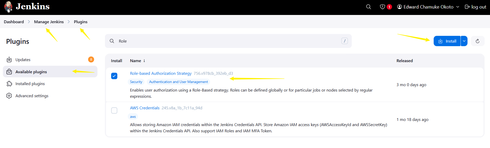

# Configuration-Management-With-Helm

## CI/CD Pipeline With Helm Integration.

### Project Components 1.

#### Jenkins Server Setup

---

#### **Installing Jenkins: Complete Guide**
Jenkins is a popular **automation server** used for **CI/CD (Continuous Integration & Continuous Deployment)**. To install Jenkins, we first need to ensure the required **dependencies** are installed.

---

#### **Step 1: Install Java (Required Dependency)**
Jenkins requires **Java** (JDK 11 or JDK 17).  
#### **For Ubuntu/Debian**
Run:
```sh
sudo apt update
sudo apt install openjdk-11-jdk
```
Verify Java installation:
```sh
java -version
```
Expected output:
```
openjdk version "11.0.19"
```

#### **For CentOS/RHEL**
```sh
sudo yum install java-11-openjdk
```
Verify Java:
```sh
java -version
```

#### 🔹 **For Windows**
1️⃣ Download **Java JDK** from [Oracle](https://www.oracle.com/java/technologies/javase-jdk11-downloads.html) or [OpenJDK](https://openjdk.org/).  
2️⃣ Install it and **add Java to PATH**:
   - Open **System Properties** → **Advanced** → **Environment Variables**.
   - Add: `C:\Program Files\Java\jdk-11\bin`

#### 🔹 **For macOS**
Use **Homebrew** to install Java:
```sh
brew install openjdk@11
```

---

#### **Step 2: Download & Install Jenkins**
#### 🔹 **Ubuntu/Debian**
```sh
wget -q -O - https://pkg.jenkins.io/debian-stable/jenkins.io.key | sudo apt-key add -
echo "deb https://pkg.jenkins.io/debian-stable binary/" | sudo tee /etc/apt/sources.list.d/jenkins.list
sudo apt update
sudo apt install jenkins
```
✔ **Jenkins service starts automatically**.

#### 🔹 **CentOS/RHEL**
```sh
sudo yum install epel-release
sudo yum install java-11-openjdk
sudo yum install jenkins
sudo systemctl enable jenkins
sudo systemctl start jenkins
```
Verify Jenkins:
```sh
systemctl status jenkins
```

#### **Windows**
1️⃣ Download `.msi` installer from [Jenkins official website](https://www.jenkins.io/download/).  
2️⃣ Run the installer and follow the **setup wizard**.  
3️⃣ **Jenkins installs as a Windows service**, so it will start automatically.

#### **macOS**
Use **Homebrew**:
```sh
brew install jenkins-lts
brew services start jenkins-lts
```

---

#### **Step 3: Start Jenkins**
✔ If Jenkins doesn’t start automatically, use:
#### 🔹 **Ubuntu/Debian**
```sh
sudo systemctl start jenkins
```
#### 🔹 **CentOS/RHEL**
```sh
sudo systemctl start jenkins
```
#### 🔹 **Windows/macOS (`.war` method)**
If you installed Jenkins as a **standalone `.war` file**, run:
```sh
java -jar jenkins.war
```

---

#### **Step 4: Access Jenkins UI**
1️⃣ Open your browser and go to:
```
http://localhost:8080

```
2️⃣ **Unlock Jenkins** using the admin password:
```sh
sudo cat /var/lib/jenkins/secrets/initialAdminPassword  # Linux/macOS
type C:\Program Files\Jenkins\secrets\initialAdminPassword  # Windows
```

#### Install desired pluggins

**manage Jenkins**>**Plugins**>**Available plugins**

- Use the search bar to search for choice plugins and **Install**


#### ✅ **Basic Security Measures for Jenkins Server**
Securing Jenkins is crucial to protect your **CI/CD pipeline, stored credentials, and sensitive configurations**. Here are the **essential security measures**:

---

#### 🔒 **1️⃣ Secure Authentication & User Management**
✔ Enable **Jenkins security settings**  
✔ Use **strong passwords & restrict login attempts**  
✔ **Implement Role-Based Access Control (RBAC)** using **Matrix Authorization Strategy**

Implementing **Role-Based Access Control (RBAC) in Jenkins using the Matrix Authorization Strategy** allows **granular permission control**, ensuring users have only the **necessary access**. Here's how you can configure it:

###### ✅ **Step 1: Install Matrix Authorization Strategy Plugin**
1️⃣ Navigate to **Manage Jenkins → Plugin Manager**.  
2️⃣ Search for **“Matrix Authorization Strategy”** plugin.  
3️⃣ Install and restart Jenkins.



---

###### 🔒 **Step 2: Enable Role-Based Access Control**
1️⃣ Go to **Manage Jenkins → Configure Global Security**.  
2️⃣ Under **Authorization**, select **“Matrix-based security”**.  
3️⃣ Add users or groups and assign appropriate permissions.

---

###### **Step 3: Define User Roles & Permissions**
✔ Assign **Admins** full control (`Overall Administer`).  
✔ Limit **Developers** to manage builds (`Job Configure & Build`).  
✔ Restrict access to sensitive areas for **Read-Only users** (`Overall Read`).  

Example **RBAC Permission Table**:
| Role        | Overall | Job | View | Run |
|------------|---------|-----|------|----|
| Admin      | ✅ Full Access | ✅ Full Access | ✅ Full Access | ✅ Full Access |
| Developer  | ❌ No Admin | ✅ Configure Builds | ✅ Read Views | ✅ Trigger Jobs |
| Viewer     | ✅ Read Only | ❌ No Job Access | ✅ View Dashboards | ❌ No Build Access |


---

###### **Step 4: Apply & Test Security Settings**
✔ Save changes.  
✔ Have users **log in and confirm** proper role enforcement.  
✔ Review **Jenkins logs** for security violations.


✔ Enforce **Single Sign-On (SSO)** with LDAP or OAuth  

---

#### 🔒 **2️⃣ Secure Communication (HTTPS & Reverse Proxy)**
✔ Use **SSL/TLS certificates** to encrypt traffic  
✔ Configure **Nginx or Apache as a reverse proxy**  
✔ Avoid exposing **Jenkins directly to the internet**  

---

#### 🔒 **3️⃣ Plugin Security & Dependency Management**
✔ Only install **trusted Jenkins plugins**  
✔ Regularly update **Jenkins core & plugins** to patch vulnerabilities  
✔ Audit installed plugins for **known security risks**  

---

#### 🔒 **4️⃣ Secure Credentials & Secrets Management**
✔ Use **Jenkins Credentials Manager** (avoid hardcoding passwords)  
✔ Store secrets in **vaults** like HashiCorp Vault or AWS Secrets Manager  
✔ Limit access to **SSH keys, API tokens, and environment variables**  

---

#### 🔒 **5️⃣ Hardening Jenkins Configurations**
✔ Disable **anonymous access** & enforce authentication  
✔ Restrict **job execution permissions** to trusted users  
✔ Enable **security audit logs** to monitor unauthorized access  

---
### Project Components 2.

#### Working With Helm Charts
---

#### Helm Chart Basics.

##### **Fundamental Concepts of Helm Charts**
Helm charts are **packaged Kubernetes applications** that simplify deployment and management. Here are the **core concepts**:

---

##### **1️⃣ Chart Structure**
A **Helm chart** consists of files and directories defining Kubernetes resources. The typical structure:
```
my-chart/
├── Chart.yaml      # Metadata (name, version, description)
├── values.yaml     # Default configuration values
├── templates/      # Kubernetes resource manifests
├── requirements.yaml # (Helm 2) Dependency management
└── charts/         # Subcharts (dependencies)
```
✔ Charts are **versioned**, reusable, and customizable.

---

##### **2️⃣ Values.yaml (Configuration Management)**
Helm charts use `values.yaml` to store **default configurations**.  
To override values during deployment:
```sh
helm install my-app my-chart -f custom-values.yaml
```
✔ Enables **parameterized deployments**.

---

##### **3️⃣ Helm Lifecycle Commands**
✔ **Install a chart**:  
   ```sh
   helm install my-app my-chart-repo/my-chart
   ```
✔ **Upgrade a release**:
   ```sh
   helm upgrade my-app my-chart-repo/my-chart
   ```
✔ **Rollback a failed deployment**:
   ```sh
   helm rollback my-app 1
   ```

---

##### **4️⃣ Templates & Kubernetes Resources**
Helm uses **Go templating** to **dynamically generate Kubernetes manifests**.  
Example template (`deployment.yaml` inside `templates/`):
```yaml
apiVersion: apps/v1
kind: Deployment
metadata:
  name: {{ .Values.appName }}
spec:
  replicas: {{ .Values.replicaCount }}
```
✔ Uses placeholders from `values.yaml` for **customizable deployments**.

---

##### **5️⃣ Dependency Management**
Helm **automatically installs dependent charts** using the `Chart.yaml` file:
```yaml
dependencies:
  - name: redis
    version: "6.0.0"
    repository: "https://charts.bitnami.com/bitnami"
```
✔ Dependencies are installed with `helm dependency update`.

---


### **Creating a Basic Helm Chart for a Web Application**  
Helm charts simplify Kubernetes deployments by packaging applications into reusable, configurable units. Let's create a **basic Helm chart** for a web app.

---

##### ✅ **Step 1: Install Helm (If Not Installed)**
Run:
```sh
curl -fsSL https://raw.githubusercontent.com/helm/helm/main/scripts/get-helm-3 | bash
```
✔ Verify installation:
```sh
helm version
```
---

##### ✅ **Step 2: Create a Helm Chart**
- Create project directory.

```
mkdir helm-webApp

cd helm-webapp
```


Generate a new Helm chart:
```sh
helm create my-webapp
```


✔ This creates a directory with default Helm chart files.

---

##### ✅ **Step 3: Modify `values.yaml` (Application Configuration)**
Edit `values.yaml` to define **image details**:

```
cd my-webapp/
```
```
notepad values.yaml
```
Edit the file

```yaml
image:
  repository: helm-webApp/my-webapp
  tag: latest
replicaCount: 2
service:
  type: ClusterIP
  port: 80
```
✔ Specifies the **Docker image** and **service details**.

---

##### ✅ **Step 4: Define Kubernetes Resources in `templates/`**
Modify `deployment.yaml` in the `templates/` directory:
```yaml
apiVersion: apps/v1
kind: Deployment
metadata:
  name: {{ .Release.Name }}
spec:
  replicas: {{ .Values.replicaCount }}
  selector:
    matchLabels:
      app: my-webapp
  template:
    metadata:
      labels:
        app: my-webapp
    spec:
      containers:
        - name: my-webapp
          image: "{{ .Values.image.repository }}:{{ .Values.image.tag }}"
          ports:
            - containerPort: 80
```
✔ Defines a **Kubernetes deployment** using **Helm variables**.

#### **Helm Chart Templating Basics**
Helm uses **Go-based templating** to dynamically generate Kubernetes manifests, allowing flexibility in defining resources. Let’s break down the key concepts:

---

##### **1️⃣ Template Files (`templates/`)**
Helm stores Kubernetes manifests in the `templates/` directory. These files contain placeholders that get replaced with values from `values.yaml`.

Example **`templates/deployment.yaml`**:
```yaml
apiVersion: apps/v1
kind: Deployment
metadata:
  name: {{ .Release.Name }}
spec:
  replicas: {{ .Values.replicaCount }}
  selector:
    matchLabels:
      app: {{ .Values.appName }}
```
✔ `{{ .Release.Name }}` → Inserts Helm release name  
✔ `{{ .Values.replicaCount }}` → Uses `values.yaml` settings  

---

#####  **2️⃣ `values.yaml` (Configuration Management)**
The `values.yaml` file stores **default values**, which can be overridden during installation.

Example:
```yaml
appName: my-web-app
replicaCount: 3
image:
  repository: nginx
  tag: latest
```
✔ `helm install my-web-app ./chart -f custom-values.yaml` → Overrides defaults

---

#####  **3️⃣ Control Structures (Conditionals & Loops)**
Helm templates support **logic** inside manifests.

✔ **Conditionals (`if` statements)**:
```yaml
{{- if .Values.ingress.enabled }}
apiVersion: networking.k8s.io/v1
kind: Ingress
metadata:
  name: {{ .Release.Name }}-ingress
spec:
  rules:
    - host: {{ .Values.ingress.host }}
      http:
        paths:
          - path: /
{{- end }}
```
✔ Creates an **Ingress** only if `ingress.enabled=true` in `values.yaml`.

✔ **Loops (`range` function)**:
```yaml
{{- range .Values.hosts }}
- host: {{ .host }}
  paths:
    - path: {{ .path }}
{{- end }}
```
✔ Iterates over **multiple hosts** defined in `values.yaml`.

---

##### **4️⃣ `helm install` & Template Rendering**
To see what a Helm chart will generate **before deploying**, run:
```sh
helm template my-app ./chart
```
✔ Renders **Kubernetes YAML** without applying it.

---

##### ✅ **Step 5: Install the Helm Chart**
Deploy the application in Kubernetes:
```sh
helm install my-web-release ./my-webapp
```


✔ Confirms successful installation:

```sh
helm list
```

---


## Customize Helm Chart

Helm charts, values, and templates are the core components of Helm, a Kubernetes package manager. 

---

#### **1. Helm Charts**
A Helm chart is a collection of files that define Kubernetes resources for deploying an application. It simplifies the deployment process by bundling all necessary configurations into a reusable package.

#### **Structure of a Helm Chart**
- **Chart.yaml**: Contains metadata about the chart, such as its name, version, and description.
- **values.yaml**: Defines default configuration values for the chart.
- **templates/**: Contains template files that generate Kubernetes manifests based on the values provided.
- **charts/**: Holds dependencies for the chart.
- **README.md**: Provides documentation for the chart.

Charts can be used to deploy simple applications (e.g., a single pod) or complex ones (e.g., a web app stack with databases and caches).

---

#### **2. Values**
The `values.yaml` file is used to define default configuration values for a Helm chart. These values can be overridden during deployment to customize the application for different environments (e.g., development, staging, production).

#### **How Values Work**
- **Default Values**: Specified in `values.yaml`.
- **Override Values**: You can override defaults using a custom values file or command-line flags:
  ```bash
  helm install my-release my-chart --values=my-values.yaml
  ```
- **Dynamic Configuration**: Values are passed to templates to dynamically generate Kubernetes manifests.

---

#### **3. Templates**
Templates are files in the `templates/` directory that use Go's templating language to generate Kubernetes manifests. They allow you to create dynamic configurations based on the values provided.

##### **How Templates Work**
- Templates use placeholders like `{{ .Values.key }}` to insert values from `values.yaml`.
- They support conditional logic, loops, and functions for advanced customization.
- Example template for a Kubernetes Deployment:
  ```yaml
  apiVersion: apps/v1
  kind: Deployment
  metadata:
    name: {{ .Values.name }}
  spec:
    replicas: {{ .Values.replicas }}
    template:
      spec:
        containers:
        - name: {{ .Values.containerName }}
          image: {{ .Values.image }}
  ```

---

#### **How They Work Together**
1. **Chart**: Provides the structure and files needed for deployment.
2. **Values**: Supplies configuration data to customize the deployment.
3. **Templates**: Dynamically generate Kubernetes manifests using the values provided.

---

#### Exploring the `my-webapp` Directory of our project
- Navigate to the `my-webapp` directory created by Helm,inside,you will find
    - `chart.yaml`: Contains metadata about the chart such as name,version and description.
    - `values.yaml`: Provides configuration values that helm will inject into the template.Here you set default configuration values.
    - `templates/`: Contains the template files that will generate kubernetes manifest files.These templates references the values defined in the `values.yaml`

```
cd my-webapp/

ls
```


#### Modify `values.yaml`

- Open `values.yaml` in a text editor
 
    ```
    vi values.yaml
    ```

- Set the image to use the Nginx stable version

    ```
    replicaCount: 3

    image:
    repository: nginx
    tag: stable
    pullPolicy: IfNotPresent
    ```

    


- The configuration will deploy three replicas (`replicaCount: 3`) of the Nginx server.

- Save changes.


#### Customize the  `templates/deployment.yaml`

- Open the `deployment.yaml` file in the `templates/` directory.

    

- Remove the line below from under  `spec.template.spec.containers.resources`

    ```
    {"{- toYaml .Values.resources | nindent 12 "}}
    ``
- Add a simple resource request and limit under `spec.template.spec.containers.resources`.This helps kubernetes manages resources efficiently.
 
    ```
    resources:
    requests:
        memory: "128Mi"
        cpu: "100m"
    limits:
        memory: "256Mi"
        cpu: "200m"
    ```
- These settings specify that the deployment should request 128Mi of memory and 100m of CPU but it wont use more than 236mi of memory and 200m of CPU.

- Save the file after making changes.

    ```
    apiVersion: apps/v1
    kind: Deployment
    metadata:
    name: {{ include "webapp.fullname" . }}
    labels:
        {{- include "webapp.labels" . | nindent 4 }}
    spec:
    {{- if not .Values.autoscaling.enabled }}
    replicas: {{ .Values.replicaCount }}
    {{- end }}
    selector:
        matchLabels:
        {{- include "webapp.selectorLabels" . | nindent 6 }}
    template:
        metadata:
        {{- with .Values.podAnnotations }}
        annotations:
            {{- toYaml . | nindent 8 }}
        {{- end }}
        labels:
            {{- include "webapp.labels" . | nindent 8 }}
            {{- with .Values.podLabels }}
            {{- toYaml . | nindent 8 }}
            {{- end }}
        spec:
        {{- with .Values.imagePullSecrets }}
        imagePullSecrets:
            {{- toYaml . | nindent 8 }}
        {{- end }}
        serviceAccountName: {{ include "webapp.serviceAccountName" . }}
        {{- with .Values.podSecurityContext }}
        securityContext:
            {{- toYaml . | nindent 8 }}
        {{- end }}
        containers:
            - name: {{ .Chart.Name }}
            {{- with .Values.securityContext }}
            securityContext:
                {{- toYaml . | nindent 12 }}
            {{- end }}
            image: "{{ .Values.image.repository }}:{{ .Values.image.tag | default .Chart.AppVersion }}"
            imagePullPolicy: {{ .Values.image.pullPolicy }}
            ports:
                - name: http
                containerPort: {{ .Values.service.port }}
                protocol: TCP
            {{- with .Values.livenessProbe }}
            livenessProbe:
                {{- toYaml . | nindent 12 }}
            {{- end }}
            {{- with .Values.readinessProbe }}
            readinessProbe:
                {{- toYaml . | nindent 12 }}
            {{- end }}
            resources:
                requests:
                memory: "128Mi"
                cpu: "100m"
                limits:
                memory: "256Mi"
                cpu: "200m"
            {{- with .Values.volumeMounts }}
            volumeMounts:
                {{- toYaml . | nindent 12 }}
            {{- end }}
        {{- with .Values.volumes }}
        volumes:
            {{- toYaml . | nindent 8 }}
        {{- end }}
        {{- with .Values.nodeSelector }}
        nodeSelector:
            {{- toYaml . | nindent 8 }}
        {{- end }}
        {{- with .Values.affinity }}
        affinity:
            {{- toYaml . | nindent 8 }}
        {{- end }}
        {{- with .Values.tolerations }}
        tolerations:
            {{- toYaml . | nindent 8 }}
        {{- end }}
        
    ```

    

- Commit and Push changes

    ```
    git add .
    git commit -m "Customized Helm chart"
    git push
    ```

# Deploying Your Application

1. **Deploy With Helm** : Navigate to the root of the project directory `helm-webApp`

    Deploy the application on kubernetes using the below command

    Use `helm lint` to check for intregrity of the charts.It will point out any syntax/indentation errors.

    ```
    helm lint ./my-webapp
    ```

    ```
    helm install my-webapplication-release ./my-webapp
    ```

    

2. **Check Deployment** : 

    ```
    kubectl get deployments
    ```

    

3. **Visit Application URL** :

    ```
    export NODE_PORT=$(kubectl get --namespace default -o jsonpath="{.spec.ports[0].nodePort}" services my-webapplication-release)

    export NODE_IP=$(kubectl get nodes --namespace default -o jsonpath="{.items[0].status.addresses[0].address}")

    echo http://$NODE_IP:$NODE_PORT


    kubectl port-forward --namespace default svc/my-webapplication-release 8081:80
    
    ```

    

    Your command is retrieving the **NodePort service endpoint** of your **Helm-deployed web application**, allowing access from outside the Kubernetes cluster.

#### ✅ **Command Breakdown**
✔ **Extracting the NodePort:**  
```sh
kubectl get --namespace default -o jsonpath="{.spec.ports[0].nodePort}" services my-webapplication-release
```
Retrieves the **NodePort** assigned to your service.

✔ **Extracting the Node's IP Address:**  
```sh
kubectl get nodes --namespace default -o jsonpath="{.items[0].status.addresses[0].address}"
```
Fetches the **IP address of the first node** in your cluster.

✔ **Printing the Access URL:**  
```sh
echo http://$NODE_IP:$NODE_PORT
```
Constructs the **final access URL** for your web application.

---

This series of commands is designed to set up **port-forwarding** for a specific Kubernetes pod in the `default` namespace. Here's a step-by-step breakdown of what each command does:

---
##### **1. Set the Pod Name**
```bash
export POD_NAME=$(kubectl get pods --namespace default -l "app.kubernetes.io/name=webapp,app.kubernetes.io/instance=my-webapp" -o jsonpath="{.items[0].metadata.name}")
```
- This command retrieves the name of the pod that matches the specified labels:
  - **`app.kubernetes.io/name=webapp`**: Looks for pods with the label `webapp`.
  - **`app.kubernetes.io/instance=my-webapp`**: Filters further to the specific instance.
- It uses the `jsonpath` filter to extract the pod name from the metadata.
- The result is stored in the `POD_NAME` environment variable for further use.

---

##### **2. Set the Container Port**
```bash
export CONTAINER_PORT=$(kubectl get pod --namespace default $POD_NAME -o jsonpath="{.spec.containers[0].ports[0].containerPort}")
```
- This retrieves the container's exposed port within the pod. Specifically:
  - It queries the `default` namespace for the pod stored in `POD_NAME`.
  - It accesses the `spec.containers[0].ports[0].containerPort` field to extract the first container port.
- The extracted port number is stored in the `CONTAINER_PORT` environment variable.

---

##### **3. Set Up Port Forwarding**
```bash
kubectl --namespace default port-forward $POD_NAME 8081:$CONTAINER_PORT
```
- This forwards traffic from **localhost:8081** to the container's port within the pod:
  - **`8081`**: The local port on your machine.
  - **`$CONTAINER_PORT`**: The container port within the pod (from the previous command).
- Effectively, this allows you to access the containerized application running inside Kubernetes via `localhost:8081`.

---

##### **Use Case**
This process is typically used during **development and testing** to interact with Kubernetes workloads locally without exposing services externally.

visit http://127.0.0.1:8081 to use your application.


# Integrating Helm With Jenkins

### 1.**Jenkins Setup**
 Guide to downloading, installing, and setting up Jenkins, including the **Java dependency** 

---
##### **Step 1: Install Java**
Jenkins requires Java to run. Follow these steps to install a supported version of Java (Java 11 or Java 17 is recommended):

1. **Download Java**  
   - Visit [Oracle](https://www.oracle.com/java/technologies/javase-downloads.html) or [OpenJDK](https://openjdk.org/install/).
   - Choose the Java Development Kit (JDK) for your operating system.

2. **Install Java**  
   - Run the downloaded installer and follow the installation wizard.
   - Note the installation directory (e.g., `C:\Program Files\Java\jdk-11`).

3. **Set Up PATH**  
   - Add the `bin` directory to your system's PATH environment variable:
     - Open **System Properties** > **Advanced** > **Environment Variables**.
     - Under **System Variables**, edit `PATH` and add:
       ```
       C:\Program Files\Java\jdk-11\bin
       ```

4. **Verify Java Installation**  
   Open Command Prompt or PowerShell and run:
   ```bash
   java -version
   ```
   You should see the installed Java version.

---

##### **Step 2: Download Jenkins**
- Go to the official Jenkins website: [Jenkins Downloads](https://www.jenkins.io/download/).
- Choose the installer suitable for your operating system:
  - For **Windows**: `.msi` file.
  - For **Linux**: Install via repository.
  - For **macOS**: Homebrew or `.war` file.

---

##### **Step 3: Install Jenkins**
##### **For Windows:**
1. Run the `.msi` installer.
2. Follow the setup wizard and choose the default settings.
3. Jenkins will install as a Windows service, allowing it to start automatically.

##### **For Linux:**
1. Install Jenkins via the repository (example for Debian/Ubuntu):
   ```bash
   sudo apt update
   sudo apt install jenkins
   ```
2. Start Jenkins:
   ```bash
   sudo systemctl start jenkins
   ```

##### **For macOS:**
1. Install Jenkins using Homebrew:
   ```bash
   brew install jenkins-lts
   ```
2. Start Jenkins:
   ```bash
   brew services start jenkins-lts
   ```

---

##### **Step 4: Start Jenkins**
For `.war` installations, use the following command:
```bash
java -jar jenkins.war
```

---

##### **Step 5: Access Jenkins**
1. Open your browser and navigate to:
   ```
   http://localhost:8080
   ```
2. Unlock Jenkins using the initial admin password:
   - **Windows**: Locate the password in `C:\Program Files\Jenkins\secrets\initialAdminPassword`.
   - **Linux/macOS**: Run:
     ```bash
     sudo cat /var/lib/jenkins/secrets/initialAdminPassword
     ```

---

##### **Step 6: Complete Setup**
1. Install **recommended plugins**.
2. Create an admin user account.
3. Jenkins is ready to use!
---

#### **Determine Helm Binary Path**
- The full binary path of Helm is required in the Jenkins pipeline script.
- To find it, use
  - Linux/macOS: `which helm`
  - Windows: `Get-Command helm | Select-Object -ExpandProperty Source` 

   

#### 3.**Create a Jenkins Pipeline**
- In jenkins, create a new pipeline job
- Set the pipeline source as the Git repository you pushed your code to.
- Configure the pipeline to trigger a build on commit to your repository.

---

##### **Steps Recap**

##### **Step 3: Create a Jenkins Pipeline**
1. **Create Pipeline Job**:
   - Open your Jenkins dashboard and click **New Item**.
   - Select **Pipeline**, name your job, and click **OK**.

   

2. **Set Git Repository as Pipeline Source**:
   - Under **Pipeline**, choose **Pipeline script from SCM**.
   - Set the repository URL where your code is hosted (e.g., GitHub, GitLab).
   - Configure authentication if needed to access the repository.

   

3. **Trigger Build on Commit**:
   - Set up a webhook on your Git repository that triggers Jenkins builds on push events.
     - Check the `GitHub hook trigger for GITScm polling`
     - `Apply` and `Save`

    

     - Configure the github repository to use the webhook trigger.
     - On your repository click `settings`> `Webhooks`> `Add Webhook`

      

     - **Payload URL**: http://172.31.64.1:8080/github-webhook/
     - **Content type** : application/json
     - **Secret** : Optionally, add a secret token
     - Select desired trigger events (e.g., push, merge requests).
   - Alternatively, use Jenkins' polling mechanism under **Build Triggers**:
     - Check the **Poll SCM** option and set a schedule (e.g., `H/5 * * * *` for every 5 minutes).

  
---

### **Step 4: Pipeline Script with Full Helm Path**
Use the given pipeline script in the `Jenkinsfile` located in your Git repository:

- Create a new `Jenkinsfile` in the root directory:

  ```
  nano Jenkinsfile
  ```
- Copy and paste your pipeline script into the `Jenkinsfile`:

    ```groovy
        pipeline {
        agent any
        stages {
            stage('Deploy with Helm') {
                steps {
                    withCredentials([file(credentialsId: 'kubeconfig-cred-id', variable: 'KUBECONFIG')]) {
                        bat 'C:\\ProgramData\\chocolatey\\bin\\helm upgrade --install my-helm-webapp C:\\Users\\edwar\\Documents\\Myworkspace\\Configuration-Management-With-Helm\\helm-webApp\\my-webapp --namespace default'
                    }
                }
            }
        }
    }
    ```
 - Save the file (**Ctrl + O**, Enter) and exit (**Ctrl + X**) if using nano


**Key Points**:
1. The script ensures Helm uses the correct path (`/c/ProgramData/chocolatey/bin/helm`).
2. Adjust the namespace (`default`) and chart directory (`./webapp`-I used the absolute path to the webapp/) as needed.
3. Save the `Jenkinsfile` in your Git repository root for Jenkins to execute.

---

#### **Validation**
- After configuring the pipeline:
  - Commit and push your `Jenkinsfile` to the repository.
  - Trigger a manual build to ensure the pipeline runs smoothly.
  - Check the console logs in Jenkins to verify Helm is executing correctly.

  **NOTE** This build will fail because of no **AUTHENTICATION** between Jenkins and Kubernetes Cluster.
  Please refer to **Credential Challange** below to fix.

---

### **Step 5: Update Helm Chart and Trigger Jenkins Pipeline**

1. Update Helm Chart and Push changes.
- Edit the `values.yaml` in your `webapp` chart directory.
  - Change the `replicaCount` to `3` to increase the number of replicas
  - Save the changes

- Edit the `templates/deployment.yaml` File
  - Open `deployment.yaml` located in `templates` directory.
  - Locate the `resources` section under the `spec.template.spec.containers`
  - Update the resource request as follows.

    ```
    resources:
    requests:
        memory: "180Mi"
        cpu: "120m"
    ```
  - Save the file after making changes.

2. Commit and Push the Changes. 
- Use Git commands to commit these changes and push to remote repository.
- Execute these commands

    ```
    git add .
    git commit -m "Updated replicas, memory and CPU requests"
    git push
    ```

3. Jenkins Trigger Pipeline.
- Once you push the changes to the repository,the configured jenkins pipeline will detect the commit.
- Jenkins will then automatically start a new build, deploying your Helm chart with the new configurations. 

---

### **Credential Challenge**
The issue began when Jenkins pipeline failed during the Helm deployment stage with the error:  
**"Kubernetes cluster unreachable: Authentication required."**  

This happened because Jenkins was unable to authenticate with your Kubernetes cluster. Typically, Kubernetes requires credentials—either a kubeconfig file or an authentication token—to interact with the cluster API. While `kubectl` and `helm` worked manually on the system, Jenkins did not inherit the necessary authentication credentials to access the cluster.

---

#### **Resolution Process**
Systematic steps to resolve the issue:

1. **Identifying the Root Cause**:
   - Verified that Helm and kubectl were installed and functioning locally using:
     ```cmd
     helm version
     kubectl version
     ```
   - Checked Kubernetes connectivity manually with:
     ```cmd
     kubectl get nodes
     ```
   - This confirmed that the credentials required for cluster access were missing in Jenkins.

2. **Configuring Kubernetes Credentials for Jenkins**:
   - Add your kubeconfig file (located at `C:\Users\edwar\.kube\config`) as a **Secret file** in Jenkins:
     - Navigated to **Manage Jenkins** > **Manage Credentials** > **System** > **Global credentials**.
     - Uploaded the kubeconfig file and assigned it a credential ID (e.g., `kubeconfig-cred-id`).

     

3. **Referencing Kubeconfig in Your Pipeline**:
   - Modified the `Jenkinsfile` to include the `withCredentials` block, ensuring the kubeconfig file was correctly used during the pipeline execution:
     ```groovy
     pipeline {
         agent any
         stages {
             stage('Deploy with Helm') {
                 steps {
                     withCredentials([file(credentialsId: 'kubeconfig-cred-id', variable: 'KUBECONFIG')]) {
                         bat 'C:\\ProgramData\\chocolatey\\bin\\helm upgrade --install my-helm-webapp C:\\Users\\edwar\\Documents\\Myworkspace\\Configuration-Management-With-Helm\\helm-webApp\\my-webapp --namespace default'
                     }
                 }
             }
         }
     }
     ```

4. **Testing and Validating**:
   - Triggered the pipeline again, and this time, Jenkins successfully authenticated with the cluster using the kubeconfig file.
   - The Helm command executed flawlessly, deploying your application to the Kubernetes cluster.
---

#### **Outcome**
This resolution allowed Jenkins to securely interact with your Kubernetes cluster, ensuring automation of the deployment process. 
---


#TEST:webhook


## TESTING

Some Test carried out while carrying out the project.
---

### **1. Environment Validation**
   - **Objective:** Verify Minikube is running and the Kubernetes cluster is accessible.
   - **Test:** Run `minikube status` and `kubectl get nodes` to confirm the cluster's readiness.

---

### **2. Helm Chart Linting**
   - **Objective:** Ensure the Helm chart files are free of syntax errors.
   - **Test:** Execute `helm lint <chart>` to validate the chart structure and configurations.

---

### **3. Jenkins Pipeline Test**
   - **Objective:** Verify that the Jenkins pipeline executes each stage correctly.
   - **Test:** Run the pipeline with a sample application to check build, deploy, and test stages.

---

### **4. Resource Validation**
   - **Objective:** Confirm resource limits and requests are applied to deployments correctly.
   - **Test:** Use `kubectl describe pod <pod-name>` to inspect pod specifications.

---

### **5. Deployment Verification**
   - **Objective:** Check whether the application is successfully deployed and running.
   - **Test:** Run `kubectl get deployments` and `kubectl get pods` to ensure the pod statuses are "Running."

---

### **6. Application Accessibility**
   - **Objective:** Test the accessibility of the application.
   - **Test:** Set up port-forwarding (`kubectl port-forward`) and verify access via `curl http://localhost:<port>`.

---

### **7. Automated Tests**
   - **Objective:** Validate application functionality with pre-configured test scripts.
   - **Test:** Execute automated tests (e.g., unit or integration tests) within the Jenkins pipeline.

---